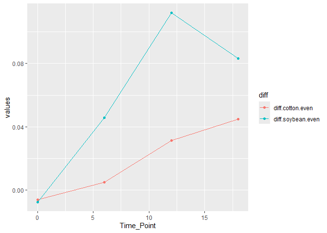

This assignment will help you practice integrating some of the tidyverse
functions into your R scripts. It will also involve some more practice
with GitHub. You may collaborate with a partner to enhance your learning
experience. Please ensure the following:

• Collaboration: If you work with a partner, include both names on the
final submission by editing the YAML header.

• Submission: Both students should submit the assignment to Canvas in a
Word, HTML, or .pdf file generated through R markdown. Additionally, you
should provide a link to your GitHub, where the assignment should be
viewable by rendering it as a GitHub-flavored markdown file.

• Setup: It is also assumed you already have a GitHub repository for
this class.

• Time: This should take you no longer than the class period to
complete.

1.  3 pts. Download two .csv files from Canvas called DiversityData.csv
    and Metadata.csv, and read them into R using relative file paths.

<!-- -->

    setwd("C:/Users/amc0369/OneDrive - Auburn University/Documents/AU/2026 SPRING-PLPA6820/Project/PLPA6820-Amanda")
    library(tidyverse)

    ## Warning: package 'tidyverse' was built under R version 4.5.2

    ## ── Attaching core tidyverse packages ──────────────────────── tidyverse 2.0.0 ──
    ## ✔ dplyr     1.1.4     ✔ readr     2.1.5
    ## ✔ forcats   1.0.1     ✔ stringr   1.5.2
    ## ✔ ggplot2   4.0.0     ✔ tibble    3.3.0
    ## ✔ lubridate 1.9.4     ✔ tidyr     1.3.1
    ## ✔ purrr     1.1.0     
    ## ── Conflicts ────────────────────────────────────────── tidyverse_conflicts() ──
    ## ✖ dplyr::filter() masks stats::filter()
    ## ✖ dplyr::lag()    masks stats::lag()
    ## ℹ Use the conflicted package (<http://conflicted.r-lib.org/>) to force all conflicts to become errors

    DiversityData <- read_csv("DiversityData.csv", na= 'NA')

    ## Rows: 70 Columns: 5
    ## ── Column specification ────────────────────────────────────────────────────────
    ## Delimiter: ","
    ## chr (1): Code
    ## dbl (4): shannon, invsimpson, simpson, richness
    ## 
    ## ℹ Use `spec()` to retrieve the full column specification for this data.
    ## ℹ Specify the column types or set `show_col_types = FALSE` to quiet this message.

    Metadata <- read_csv("Metadata.csv", na = 'NA')

    ## Rows: 70 Columns: 5
    ## ── Column specification ────────────────────────────────────────────────────────
    ## Delimiter: ","
    ## chr (3): Code, Crop, Water_Imbibed
    ## dbl (2): Time_Point, Replicate
    ## 
    ## ℹ Use `spec()` to retrieve the full column specification for this data.
    ## ℹ Specify the column types or set `show_col_types = FALSE` to quiet this message.

1.  4 pts. Join the two dataframes together by the common column ‘Code’.
    Name the resulting dataframe alpha.

<!-- -->

    library(tidyverse)
    library(dplyr)

    alpha <- full_join(DiversityData, Metadata, by = 'Code')
    alpha

    ## # A tibble: 70 × 9
    ##    Code   shannon invsimpson simpson richness Crop  Time_Point Replicate
    ##    <chr>    <dbl>      <dbl>   <dbl>    <dbl> <chr>      <dbl>     <dbl>
    ##  1 S01_13    6.62       211.   0.995     3319 Soil           0         1
    ##  2 S02_16    6.61       207.   0.995     3079 Soil           0         2
    ##  3 S03_19    6.66       213.   0.995     3935 Soil           0         3
    ##  4 S04_22    6.66       205.   0.995     3922 Soil           0         4
    ##  5 S05_25    6.61       200.   0.995     3196 Soil           0         5
    ##  6 S06_28    6.65       199.   0.995     3481 Soil           0         6
    ##  7 S61_32    6.57       200.   0.995     3250 Soil           6         1
    ##  8 S62_35    6.49       171.   0.994     3170 Soil           6         2
    ##  9 S63_38    6.61       192.   0.995     3657 Soil           6         3
    ## 10 S64_41    6.47       164.   0.994     3177 Soil           6         4
    ## # ℹ 60 more rows
    ## # ℹ 1 more variable: Water_Imbibed <chr>

1.  4 pts. Calculate Pielou’s evenness index: Pielou’s evenness is an
    ecological parameter calculated by the Shannon diversity index
    (column Shannon) divided by the log of the richness column.

<!-- -->

1.  Using mutate, create a new column to calculate Pielou’s evenness
    index.

<!-- -->

    alpha_even <- mutate(alpha, pielous = shannon/ log(richness))
    alpha_even

    ## # A tibble: 70 × 10
    ##    Code   shannon invsimpson simpson richness Crop  Time_Point Replicate
    ##    <chr>    <dbl>      <dbl>   <dbl>    <dbl> <chr>      <dbl>     <dbl>
    ##  1 S01_13    6.62       211.   0.995     3319 Soil           0         1
    ##  2 S02_16    6.61       207.   0.995     3079 Soil           0         2
    ##  3 S03_19    6.66       213.   0.995     3935 Soil           0         3
    ##  4 S04_22    6.66       205.   0.995     3922 Soil           0         4
    ##  5 S05_25    6.61       200.   0.995     3196 Soil           0         5
    ##  6 S06_28    6.65       199.   0.995     3481 Soil           0         6
    ##  7 S61_32    6.57       200.   0.995     3250 Soil           6         1
    ##  8 S62_35    6.49       171.   0.994     3170 Soil           6         2
    ##  9 S63_38    6.61       192.   0.995     3657 Soil           6         3
    ## 10 S64_41    6.47       164.   0.994     3177 Soil           6         4
    ## # ℹ 60 more rows
    ## # ℹ 2 more variables: Water_Imbibed <chr>, pielous <dbl>

1.  Name the resulting dataframe alpha\_even.

<!-- -->

1.  1.  Pts. Using tidyverse language of functions and the pipe, use the
        summarise function and tell me the mean and standard error
        evenness grouped by crop over time.

<!-- -->

1.  Start with the alpha\_even dataframe

2.  Group the data: group the data by Crop and Time\_Point.

3.  Summarize the data: Calculate the mean, count, standard deviation,
    and standard error for the even variable within each group.

4.  Name the resulting dataframe alpha\_average

<!-- -->

    alpha_average <- alpha_even %>%
      group_by(Crop, Time_Point) %>%
      summarise(mean_even = mean(pielous),
                n = length(pielous),
                sd.dev = sd(pielous)) %>%
      mutate(sd.er = sd.dev/sqrt(n))

    ## `summarise()` has grouped output by 'Crop'. You can override using the
    ## `.groups` argument.

    alpha_average

    ## # A tibble: 12 × 6
    ## # Groups:   Crop [3]
    ##    Crop    Time_Point mean_even     n  sd.dev   sd.er
    ##    <chr>        <dbl>     <dbl> <int>   <dbl>   <dbl>
    ##  1 Cotton           0     0.820     6 0.00556 0.00227
    ##  2 Cotton           6     0.805     6 0.00920 0.00376
    ##  3 Cotton          12     0.767     6 0.0157  0.00640
    ##  4 Cotton          18     0.755     5 0.0169  0.00755
    ##  5 Soil             0     0.814     6 0.00765 0.00312
    ##  6 Soil             6     0.810     6 0.00587 0.00240
    ##  7 Soil            12     0.798     6 0.00782 0.00319
    ##  8 Soil            18     0.800     5 0.0104  0.00465
    ##  9 Soybean          0     0.822     6 0.00270 0.00110
    ## 10 Soybean          6     0.764     6 0.0400  0.0163 
    ## 11 Soybean         12     0.687     6 0.0643  0.0263 
    ## 12 Soybean         18     0.716     6 0.0153  0.00626

1.  1.  Pts. Calculate the difference between the soybean column, the
        soil column, and the difference between the cotton column and
        the soil column

<!-- -->

1.  Start with the alpha\_average dataframe

2.  Select relevant columns: select the columns Time\_Point, Crop, and
    mean.even.

3.  Reshape the data: Use the pivot\_wider function to transform the
    data from long to wide format, creating new columns for each Crop
    with values from mean.even.

4.  Calculate differences: Create new columns named diff.cotton.even and
    diff.soybean.even by calculating the difference between Soil and
    Cotton, and Soil and Soybean, respectively.

5.  Name the resulting dataframe alpha\_average2

<!-- -->

    alpha_average2 <- alpha_average %>%
      select(Time_Point, Crop, mean_even) %>%
      pivot_wider(names_from = Crop, values_from = mean_even) %>%
      mutate(diff.cotton.even = Soil - Cotton,
             diff.soybean.even = Soil - Soybean
      ) 

1.  4 pts. Connecting it to plots

<!-- -->

1.  Start with the alpha\_average2 dataframe

2.  Select relevant columns: select the columns Time\_Point,
    diff.cotton.even, and diff.soybean.even.

3.  Reshape the data: Use the pivot\_longer function to transform the
    data from wide to long format, creating a new column named diff that
    contains the values from diff.cotton.even and diff.soybean.even.

4.  This might be challenging, so I’ll give you a break. The code is
    below.

pivot\_longer(c(diff.cotton.even, diff.soybean.even), names\_to =
“diff”)

1.  Create the plot: Use ggplot and geom\_line() with ‘Time\_Point’ on
    the x-axis, the column ‘values’ on the y-axis, and different colors
    for each ‘diff’ category. The column named ‘values’ come from the
    pivot\_longer. The resulting plot should look like the one to the
    right.

<!-- -->

    library(ggplot2)

    plot <- alpha_average2 %>%
      select(Time_Point, diff.cotton.even, diff.soybean.even) %>%
      pivot_longer(c(diff.cotton.even, diff.soybean.even), names_to = "diff", values_to = "values")

    ggplot(plot, aes(x = Time_Point, y = values, colour = diff, group = diff))+
      geom_line()+
      geom_point()

1.  2 pts. Commit and push a gfm .md file to GitHub inside a directory
    called Coding Challenge 5. Provide me a link to your github written
    as a clickable link in your .pdf or .docx

[GitHub link](https://github.com/Matioli-amoc/PLPA6820-Amanda.git)
