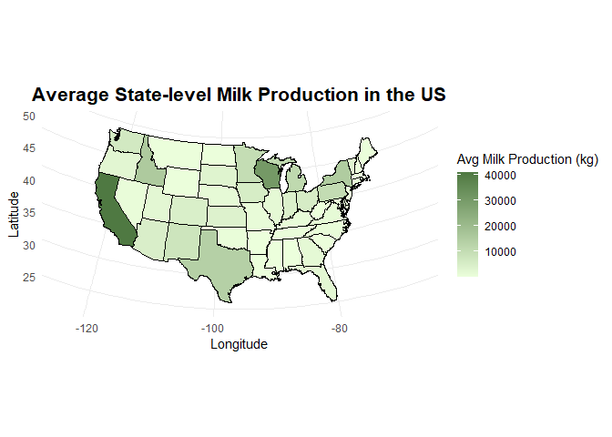

# Bonus material assignment

[GitHub Link](https://github.com/Matioli-amoc/PLPA6820-Amanda.git)

## RENV annotation

    install.packages("renv", repos = "https://rstudio.r-universe.dev")

    ## The following package(s) will be installed:
    ## - renv [1.2.0.9000]
    ## These packages will be installed into "~/AU/2026 SPRING-PLPA6820/Project/PLPA6820-Amanda/renv/library/windows/R-4.5/x86_64-w64-mingw32".
    ## 
    ## # Installing packages --------------------------------------------------------
    ## ✔ renv 1.2.0.9000                          [linked from cache]
    ## Successfully installed 1 package in 19 milliseconds.

    #renv::init() <- write directly on the console source pane.
    #All the library will be writen and a new folder called "renv" will be created in the project directory.

That will linking packages into the project library. The new folder
called “renv” will shows all the packages already installed. Will create
a activate.R file, that will have a code to run qhen we need to restore
all the packages. When we do the initiallization the .gitignore will be
reading.

The code bellow is on the .Rprofile (the . in front of the file shows
that is a hidden file in your computer)

    source("renv/activate.R")

    ## - The project is out-of-sync -- use `]8;;x-r-run:renv::status()renv::status()]8;;` for details.

If we use the .libPaths() will show us where the package will pull our
imputs.Will always try the RPackage first.

The function of renv is for reproducibility of packages versions,
because packages changes all the time, so if you are running an project
from years ago, there is a possibility that the code will be running
through a old version of some packages. Renv will allow the person who
are going to reproduce the research to run the code under the same
packages versions that was runned before.

If you are running into the project under renv and want to install a new
package you just do the same code. The difference is that will ask you
if you want to install it. However, just because you intalled it, doesn
meant that you can use it on the same environment.

The new installed packeges will not be showen into the renv\_lock file,
because you need to save and ask for renv to update the lockfile using
snapshot.

Exemple:

    install.packages("paletteer")

    ## The following package(s) will be installed:
    ## - paletteer [1.7.0]
    ## These packages will be installed into "~/AU/2026 SPRING-PLPA6820/Project/PLPA6820-Amanda/renv/library/windows/R-4.5/x86_64-w64-mingw32".
    ## 
    ## # Installing packages --------------------------------------------------------
    ## ✔ paletteer 1.7.0                          [linked from cache]
    ## Successfully installed 1 package in 14 milliseconds.

To save you need to do renv::snapshot() into the console source.

When you fork and clone somebody’s repository, and besides the packages
are on the renv.lock file, the functions that are into the packages are
not automatically installed, so you need to use renv::restore() to
restore the project library.

------------------------------------------------------------------------

## In class review annotation

Subset:

    mtcars

    ##                      mpg cyl  disp  hp drat    wt  qsec vs am gear carb
    ## Mazda RX4           21.0   6 160.0 110 3.90 2.620 16.46  0  1    4    4
    ## Mazda RX4 Wag       21.0   6 160.0 110 3.90 2.875 17.02  0  1    4    4
    ## Datsun 710          22.8   4 108.0  93 3.85 2.320 18.61  1  1    4    1
    ## Hornet 4 Drive      21.4   6 258.0 110 3.08 3.215 19.44  1  0    3    1
    ## Hornet Sportabout   18.7   8 360.0 175 3.15 3.440 17.02  0  0    3    2
    ## Valiant             18.1   6 225.0 105 2.76 3.460 20.22  1  0    3    1
    ## Duster 360          14.3   8 360.0 245 3.21 3.570 15.84  0  0    3    4
    ## Merc 240D           24.4   4 146.7  62 3.69 3.190 20.00  1  0    4    2
    ## Merc 230            22.8   4 140.8  95 3.92 3.150 22.90  1  0    4    2
    ## Merc 280            19.2   6 167.6 123 3.92 3.440 18.30  1  0    4    4
    ## Merc 280C           17.8   6 167.6 123 3.92 3.440 18.90  1  0    4    4
    ## Merc 450SE          16.4   8 275.8 180 3.07 4.070 17.40  0  0    3    3
    ## Merc 450SL          17.3   8 275.8 180 3.07 3.730 17.60  0  0    3    3
    ## Merc 450SLC         15.2   8 275.8 180 3.07 3.780 18.00  0  0    3    3
    ## Cadillac Fleetwood  10.4   8 472.0 205 2.93 5.250 17.98  0  0    3    4
    ## Lincoln Continental 10.4   8 460.0 215 3.00 5.424 17.82  0  0    3    4
    ## Chrysler Imperial   14.7   8 440.0 230 3.23 5.345 17.42  0  0    3    4
    ## Fiat 128            32.4   4  78.7  66 4.08 2.200 19.47  1  1    4    1
    ## Honda Civic         30.4   4  75.7  52 4.93 1.615 18.52  1  1    4    2
    ## Toyota Corolla      33.9   4  71.1  65 4.22 1.835 19.90  1  1    4    1
    ## Toyota Corona       21.5   4 120.1  97 3.70 2.465 20.01  1  0    3    1
    ## Dodge Challenger    15.5   8 318.0 150 2.76 3.520 16.87  0  0    3    2
    ## AMC Javelin         15.2   8 304.0 150 3.15 3.435 17.30  0  0    3    2
    ## Camaro Z28          13.3   8 350.0 245 3.73 3.840 15.41  0  0    3    4
    ## Pontiac Firebird    19.2   8 400.0 175 3.08 3.845 17.05  0  0    3    2
    ## Fiat X1-9           27.3   4  79.0  66 4.08 1.935 18.90  1  1    4    1
    ## Porsche 914-2       26.0   4 120.3  91 4.43 2.140 16.70  0  1    5    2
    ## Lotus Europa        30.4   4  95.1 113 3.77 1.513 16.90  1  1    5    2
    ## Ford Pantera L      15.8   8 351.0 264 4.22 3.170 14.50  0  1    5    4
    ## Ferrari Dino        19.7   6 145.0 175 3.62 2.770 15.50  0  1    5    6
    ## Maserati Bora       15.0   8 301.0 335 3.54 3.570 14.60  0  1    5    8
    ## Volvo 142E          21.4   4 121.0 109 4.11 2.780 18.60  1  1    4    2

Subsetting

    mtcars[1,4]

    ## [1] 110

    # Find all rows such that VS = 1
    mtcars[mtcars$vs == 1,]

    ##                 mpg cyl  disp  hp drat    wt  qsec vs am gear carb
    ## Datsun 710     22.8   4 108.0  93 3.85 2.320 18.61  1  1    4    1
    ## Hornet 4 Drive 21.4   6 258.0 110 3.08 3.215 19.44  1  0    3    1
    ## Valiant        18.1   6 225.0 105 2.76 3.460 20.22  1  0    3    1
    ## Merc 240D      24.4   4 146.7  62 3.69 3.190 20.00  1  0    4    2
    ## Merc 230       22.8   4 140.8  95 3.92 3.150 22.90  1  0    4    2
    ## Merc 280       19.2   6 167.6 123 3.92 3.440 18.30  1  0    4    4
    ## Merc 280C      17.8   6 167.6 123 3.92 3.440 18.90  1  0    4    4
    ## Fiat 128       32.4   4  78.7  66 4.08 2.200 19.47  1  1    4    1
    ## Honda Civic    30.4   4  75.7  52 4.93 1.615 18.52  1  1    4    2
    ## Toyota Corolla 33.9   4  71.1  65 4.22 1.835 19.90  1  1    4    1
    ## Toyota Corona  21.5   4 120.1  97 3.70 2.465 20.01  1  0    3    1
    ## Fiat X1-9      27.3   4  79.0  66 4.08 1.935 18.90  1  1    4    1
    ## Lotus Europa   30.4   4  95.1 113 3.77 1.513 16.90  1  1    5    2
    ## Volvo 142E     21.4   4 121.0 109 4.11 2.780 18.60  1  1    4    2

    mtcars$hp[mtcars$vs == 1]

    ##  [1]  93 110 105  62  95 123 123  66  52  65  97  66 113 109

    mtcars$hp[mtcars$vs == 1][1]

    ## [1] 93

    mtcars$hp[mtcars$vs == 1 & mtcars$gear == 4]

    ##  [1]  93  62  95 123 123  66  52  65  66 109

    # Using subset function
    subset(mtcars, vs == 1)

    ##                 mpg cyl  disp  hp drat    wt  qsec vs am gear carb
    ## Datsun 710     22.8   4 108.0  93 3.85 2.320 18.61  1  1    4    1
    ## Hornet 4 Drive 21.4   6 258.0 110 3.08 3.215 19.44  1  0    3    1
    ## Valiant        18.1   6 225.0 105 2.76 3.460 20.22  1  0    3    1
    ## Merc 240D      24.4   4 146.7  62 3.69 3.190 20.00  1  0    4    2
    ## Merc 230       22.8   4 140.8  95 3.92 3.150 22.90  1  0    4    2
    ## Merc 280       19.2   6 167.6 123 3.92 3.440 18.30  1  0    4    4
    ## Merc 280C      17.8   6 167.6 123 3.92 3.440 18.90  1  0    4    4
    ## Fiat 128       32.4   4  78.7  66 4.08 2.200 19.47  1  1    4    1
    ## Honda Civic    30.4   4  75.7  52 4.93 1.615 18.52  1  1    4    2
    ## Toyota Corolla 33.9   4  71.1  65 4.22 1.835 19.90  1  1    4    1
    ## Toyota Corona  21.5   4 120.1  97 3.70 2.465 20.01  1  0    3    1
    ## Fiat X1-9      27.3   4  79.0  66 4.08 1.935 18.90  1  1    4    1
    ## Lotus Europa   30.4   4  95.1 113 3.77 1.513 16.90  1  1    5    2
    ## Volvo 142E     21.4   4 121.0 109 4.11 2.780 18.60  1  1    4    2

    subset(mtcars, vs == 1 & gear == 4)

    ##                 mpg cyl  disp  hp drat    wt  qsec vs am gear carb
    ## Datsun 710     22.8   4 108.0  93 3.85 2.320 18.61  1  1    4    1
    ## Merc 240D      24.4   4 146.7  62 3.69 3.190 20.00  1  0    4    2
    ## Merc 230       22.8   4 140.8  95 3.92 3.150 22.90  1  0    4    2
    ## Merc 280       19.2   6 167.6 123 3.92 3.440 18.30  1  0    4    4
    ## Merc 280C      17.8   6 167.6 123 3.92 3.440 18.90  1  0    4    4
    ## Fiat 128       32.4   4  78.7  66 4.08 2.200 19.47  1  1    4    1
    ## Honda Civic    30.4   4  75.7  52 4.93 1.615 18.52  1  1    4    2
    ## Toyota Corolla 33.9   4  71.1  65 4.22 1.835 19.90  1  1    4    1
    ## Fiat X1-9      27.3   4  79.0  66 4.08 1.935 18.90  1  1    4    1
    ## Volvo 142E     21.4   4 121.0 109 4.11 2.780 18.60  1  1    4    2

    subset(mtcars, vs == 1 | gear == 4)

    ##                 mpg cyl  disp  hp drat    wt  qsec vs am gear carb
    ## Mazda RX4      21.0   6 160.0 110 3.90 2.620 16.46  0  1    4    4
    ## Mazda RX4 Wag  21.0   6 160.0 110 3.90 2.875 17.02  0  1    4    4
    ## Datsun 710     22.8   4 108.0  93 3.85 2.320 18.61  1  1    4    1
    ## Hornet 4 Drive 21.4   6 258.0 110 3.08 3.215 19.44  1  0    3    1
    ## Valiant        18.1   6 225.0 105 2.76 3.460 20.22  1  0    3    1
    ## Merc 240D      24.4   4 146.7  62 3.69 3.190 20.00  1  0    4    2
    ## Merc 230       22.8   4 140.8  95 3.92 3.150 22.90  1  0    4    2
    ## Merc 280       19.2   6 167.6 123 3.92 3.440 18.30  1  0    4    4
    ## Merc 280C      17.8   6 167.6 123 3.92 3.440 18.90  1  0    4    4
    ## Fiat 128       32.4   4  78.7  66 4.08 2.200 19.47  1  1    4    1
    ## Honda Civic    30.4   4  75.7  52 4.93 1.615 18.52  1  1    4    2
    ## Toyota Corolla 33.9   4  71.1  65 4.22 1.835 19.90  1  1    4    1
    ## Toyota Corona  21.5   4 120.1  97 3.70 2.465 20.01  1  0    3    1
    ## Fiat X1-9      27.3   4  79.0  66 4.08 1.935 18.90  1  1    4    1
    ## Lotus Europa   30.4   4  95.1 113 3.77 1.513 16.90  1  1    5    2
    ## Volvo 142E     21.4   4 121.0 109 4.11 2.780 18.60  1  1    4    2

    # Subset with min and max
    max(mtcars$hp)

    ## [1] 335

    min(mtcars$hp)

    ## [1] 52

------------------------------------------------------------------------

## Bonus material annotation

[More code for putting point on a
map](https://github.com/Noel-Lab-Auburn/OomyceteDiversityinAlabamaCotton/blob/main/BiogeographyModeling.R)

### Putting points on a map (addapted from Zachary Noel - PLPA 6820,)

I chose to learn and explore the video about how to plot points in a
map, because i think its very useful for research application,
especially in genetics. When we are able to visualize spatial data we
can study the distribution of genetic variation and different animal
populations across regions. I wanted to learn how to represent the
geographic and the genetic patterns together, making it easier to
compare the populations and interpret the statistical results.

### Class annotation:

Libraries needed

    #install.packages("tidyverse")
    library(tidyverse)

    ## Warning: package 'tidyverse' was built under R version 4.5.2

    ## ── Attaching core tidyverse packages ──────────────────────── tidyverse 2.0.0 ──
    ## ✔ dplyr     1.2.1     ✔ readr     2.2.0
    ## ✔ forcats   1.0.1     ✔ stringr   1.6.0
    ## ✔ ggplot2   4.0.2     ✔ tibble    3.3.1
    ## ✔ lubridate 1.9.5     ✔ tidyr     1.3.2
    ## ✔ purrr     1.2.1     
    ## ── Conflicts ────────────────────────────────────────── tidyverse_conflicts() ──
    ## ✖ dplyr::filter() masks stats::filter()
    ## ✖ dplyr::lag()    masks stats::lag()
    ## ℹ Use the conflicted package (<http://conflicted.r-lib.org/>) to force all conflicts to become errors

    #install.packages("usmap")
    library(usmap)
    #install.packages("maps")
    library(maps)

    ## 
    ## Attaching package: 'maps'
    ## 
    ## The following object is masked from 'package:purrr':
    ## 
    ##     map

    #install.packages("mapdata")
    library(mapdata)

Collor pallets

    cbbPalette <- c("black", "#999999", "#E69F00", "#56B4E9", "#009E73", "#F0E442", "#0072B2", "#D55E00")
    options(dplyr.print_max = 1e9)

Read the data

    Dairy.mr <- read.csv("Dairy.m.csv")

    counties <- map_data("county")
    counties$State < toupper(counties$Region)

    ## logical(0)

    str(Dairy.mr)

    ## 'data.frame':    550 obs. of  9 variables:
    ##  $ Year                 : int  2014 2014 2014 2014 2014 2014 2014 2014 2014 2014 ...
    ##  $ State                : chr  "Connecticut" "Delaware" "Maine" "Maryland" ...
    ##  $ Region               : chr  "Northeast" "Northeast" "Northeast" "Northeast" ...
    ##  $ Milk_cows_state      : num  19 4.8 30 50 13 14 7 615 530 0.9 ...
    ##  $ Milk_per_cows_state  : int  20158 20104 19967 19820 17923 20143 18143 22340 20121 19000 ...
    ##  $ Milk_production_state: num  383 96.5 599 991 233 ...
    ##  $ Milk.cow             : int  9261 9261 9261 9261 9261 9261 9261 9261 9261 9261 ...
    ##  $ Milk.per.cow         : int  22249 22249 22249 22249 22249 22249 22249 22249 22249 22249 ...
    ##  $ Milk.production      : int  206048 206048 206048 206048 206048 206048 206048 206048 206048 206048 ...

    milk.production.state <- Dairy.mr %>%
      group_by(State) %>%
      summarise(mean_milk_production = mean(Milk_production_state, na.rm = TRUE))

    milk.production.state$State <- toupper(milk.production.state$State)
    state.data <- map_data("state")
    state.data$State <- toupper(state.data$region)

You can also put states of interest if you want by doing:

state.data2 &lt;- state.data %&gt;% subset(State %in% c(“ALABAMA”,
“FLORIDA”, “TEXAS”, “ARKANSAS”, “MISSISSIPPI”, “SOUTH CAROLINA”, “NORTH
CAROLINA”, “VIRGINIA”, “LOUISIANA”, “TENNESSEE”, “GEORGIA”, “OKLAHOMA”))

cotton.acres.harvested.bycounty2 &lt;- left\_join(counties,
cotton.acres.harvested.bycounty, by = c(“State”, “County”))
cotton.acres.harvested.bycounty.plot &lt;-
cotton.acres.harvested.bycounty2 %&gt;% subset(State %in% c(“ALABAMA”,
“FLORIDA”, “TEXAS”, “ARKANSAS”, “MISSISSIPPI”, “SOUTH CAROLINA”, “NORTH
CAROLINA”, “VIRGINIA”, “LOUISIANA”, “TENNESSEE”, “GEORGIA”, “OKLAHOMA”))

And also convert into hectares

cotton.acres.harvested.bycounty.plot*H**e**c**t**a**r**e**s* &lt; −*c**o**t**t**o**n*.*a**c**r**e**s*.*h**a**r**v**e**s**t**e**d*.*b**y**c**o**u**n**t**y*.*p**l**o**t*mean.acres.harvested\*0.404686
map.points &lt;- seedtreatment.prediction.nona %&gt;% group\_by(Long,
Lat) %&gt;% tally()

I’m not interested into doing this for Dairy milk production data, so i
just wrote to register what ive learned and for future analysis.

Continuing…

    milk.by.state.map <- left_join(state.data, milk.production.state, by = "State")

    Fig1 <- ggplot() +
      geom_polygon(data = milk.by.state.map, 
                   aes(x = long, y = lat, group = group, fill = mean_milk_production),
                   color = "grey", size = 0.2) +
      geom_polygon(data = milk.by.state.map, 
                   aes(x = long, y = lat, group = group), color = "black", fill = NA) +
      scale_fill_gradient(low = "#ECFFDC", high = "#4F7942", 
                          na.value = "white", 
                          name = "Avg Milk Production (kg)") +
      theme_minimal() +
      coord_map("albers", lat0 = 45.5, lat1 = 29.5) +
      xlab("Longitude") +
      ylab("Latitude") +
      ggtitle("Average State-level Milk Production in the US") +
      theme(
        legend.position = "right",
        plot.title = element_text(hjust = 0.5, size = 16, face = "bold")
      )

    ## Warning: Using `size` aesthetic for lines was deprecated in ggplot2 3.4.0.
    ## ℹ Please use `linewidth` instead.
    ## This warning is displayed once per session.
    ## Call `lifecycle::last_lifecycle_warnings()` to see where this warning was
    ## generated.

    Fig1

OBS: I dont have the lat and long of the milk production in each state,
but for get the point in the map we use:

geom\_point(data = map.points, aes(x = Long, y = Lat, size = n), fill =
cbbPalette\[\[8\]\], color = “black”, alpha = 0.6, shape = 21) +

But i really liked to learn how to use a map to set the average of milk
production and i will definitely use it every time i can!
